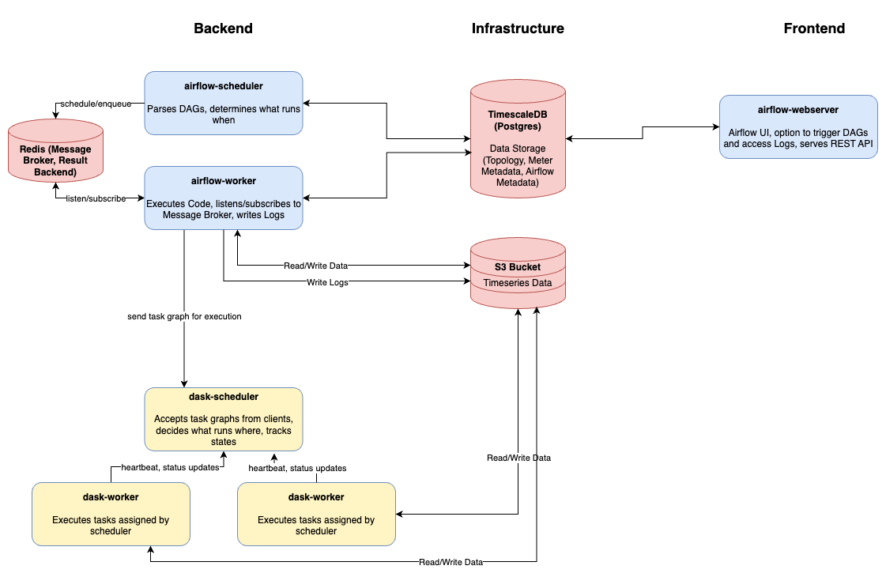

# 3-Phase-Insight Data Platform

## Introduction
This repo contains all necessary parts to spin up the 3-Phase-Insight (3Phi) Data Platform, which builds upon the 
functionality provided by [3phi-framework](https://github.com/3PhaseInsight/3phi-framework).
It is structured in a way that divides the individual components of the platform into three different parts:

- data-platform-infrastructure: contains everything that's related to the storage infrastructure, such as the Database and the MinIO Bucket Storage
- data-platform-frontend: contains the user facing part of the platform, namely the Apache Airflow Webserver
- "the rest": contains the backend part of the platform, which consists of the Apache Airflow Scheduler & Worker as well as the Dask Cluster

### Apache Airflow
Airflow is used as a task orchestration framework in this platform. It includes a Python runtime environment for running Python code.
The concept of DAGs allows defining workflows, which may also be called "Pipelines" in the 3Phi context. Airflow uses Redis as a 
Message Queue Broker for scheduling worker tasks.

A DAG (or Directed Acyclic Graphs) is a model that encapsulates everything needed to execute a workflow.
In this data platform context a DAG can be seen as a data pipeline than runs through a series of predefined steps.

A DAG can be a single task or can chain multiple tasks after one another.

See https://airflow.apache.org/docs/apache-airflow/stable/core-concepts/dags.html for additional documentation.

### Dask
Dask is a Python library for parallel and distributed computing. Pythons single-threaded nature limits compute- and processing-heavy
workflows. Dask solves this issue by introducing a Cluster consisting of the Dask Scheduler and one or more Dask Workers.

In simple words, the way Dask works, is that when Python statements using the dask library are executed, an "Execution Graph" is created,
without actually triggering any computation at first. The Execution Graph is basically just instruction after instruction and describes what
is intended to be done. Certain dask expressions, such as `.compute()` trigger the actual computation. When this happens, the serialized Execution Graph is passed from the Scheduler to the Workers, which then begin executing the steps that the Graph contains. 
The Dask Library takes care of how to split workloads up over multiple workers and join the results back together after the execution.

### MinIO
The platform (by default) uses MinIO as its object storage solution. MinIO is S3-compatible and optimized for large-scale data pipelines that require
a high performance storage solution. Using the 3phi-frameworks [BaseConnector](https://github.com/3PhaseInsight/3phi-framework/blob/main/src/threephi_framework/object_storage/base_connector.py), the platform can be adapted to different Object Storage Solutions.

### Data Directory
Place your `phase_measurements_*.csv` files in the `./data` directory so the containers can read them during ingestion. The path is mounted into all Airflow and Dask containers at `/opt/airflow/data`.

## Architecture Diagram



## Writing DAGs

DAGs live in `dags/` and their YAML configs in `dags/configs/`. The config filename must match the DAG filename (e.g. `my_pipeline.py` → `my_pipeline_config.yaml`).

Every DAG follows the same structure:

```python
from airflow import DAG
from airflow.providers.standard.operators.python import PythonOperator
from datetime import datetime

from threephi_framework import MyDataApp
from utils import load_dag_config


def run_my_pipeline():
    with MyDataApp(config=load_dag_config(__file__)) as app:
        app.run()


default_args = {
    "owner": "inilab",
    "retries": 0,
    "depends_on_past": False,
    "email_on_failure": False,
    "email_on_retry": False,
}

with DAG(
    dag_id="my_pipeline",
    description="What this pipeline does",
    default_args=default_args,
    start_date=datetime.now(),
    catchup=False,
    max_active_runs=1,
) as dag:
    PythonOperator(
        task_id="run",
        python_callable=run_my_pipeline,
    )
```

Key rules:
- `load_dag_config(__file__)` reads the matching YAML config — always call it **inside** the callable, never at module level. Airflow parses DAG files repeatedly; any code at module level runs on every parse cycle.
- Use `max_active_runs=1` on every DAG to prevent concurrent runs and data inconsistencies.
- Never access the database or object storage directly — use the abstractions provided by `threephi_framework`.

## Local Development

### Getting started
#### 1. Docker Installation
You need to have `Docker` installed and running as a desktop application. It can be downloaded from `https://www.docker.com`. You don't need to login as a user.

#### 2. Packet Manager Installation
You need a packet manager installed to be able to install further prerequisites from your terminal. 

**macOS users:**
If you don't have `Homebrew` installed, open your terminal, paste in the following command at the prompt and press 'Enter':
```bash
/bin/bash -c "$(curl -fsSL https://raw.githubusercontent.com/Homebrew/install/HEAD/install.sh)"
```

**Windows users:**
If you don't have `Chocolatey` installed:
1. Open PowerShell as Administrator (right-click Start button → "Windows PowerShell (Admin)")
2. Paste in the following command at the prompt and press 'Enter':
```powershell
iwr https://chocolatey.org/install.ps1 -UseBasicParsing | iex
```

#### 3. (optional) Set up easier/faster local dev environment

##### Creating a dev.env file
Copy the `dev.env.example` file in the data-platform repo.

```bash
cp dev.env.example dev.env
```

Edit and set your path to the 3phi-framework repo in this file.

##### Remove 3phi-framework from requirements.txt
To prevent conflicts from sourcing previously built framework versions remotely when building the framework locally, at the top of the `requirements.txt` comment or delete the line starting with `3phi-framework`. 

Note: *Do not commit this change*.

#### 4. Prepare data directory
If not specifying a data directoy, the default behaviour requires a directory `data` to be created at the root of the repository. 

#### 5. Deploy the platform locally and initialize the Database
If you are working in MacOS you should already have `make` installed, but if you work on a Windows machine you need to install it:

```powershell
choco install make
```

Now, in your terminal, navigate to the "data-platform" folder and execute the following command:
```
make up
```
This will create the Docker containers (database, dask cluster and airflow) locally on your machine. A user will be created named threephi_db_user. This user will be used by the other services when they interact with the database. At last, the database will be initialized with the necessary schemas & tables.

#### 6. Create MinIO buckets
Open the MinIO Console at http://localhost:19001 (or in Docker Desktop, click the minio container’s Console port). Sign in with `MINIO_ROOT_USER` / `MINIO_ROOT_PASSWORD` from `.env` (defaults: `minioadmin` / `minioadmin`). Create these buckets:
- `3phi` — ingested timeseries parquet files
- `airflow-logs` — Airflow task logs

#### 7. Access the Airflow UI
Open http://localhost:8080 (or click `8080:8080` in Docker Desktop for the Airflow webserver). Retrieve the admin password from the webserver logs at Docker Desktop → Airflow-webserver → Logs. Look for:
```
Simple auth manager | Password for user 'admin': <16-character-password>
```
First run: reserialize DAGs so they appear by running `airflow dags reserialize` at Docker Desktop → Airflow-webserver → Exec.

## Custom Docker Images

### Airflow
The custom airflow image is built so the defined dags and the source code are available to the Airflow containers.

### Dask
The custom dask image is built, so the source code is bundled directly in the image.


## Environment Variables

All variables are set in `.env`. The file is not committed — copy the defaults from the table below to get started.

**Database**

| Variable | Description | Default |
| --- | --- | --- |
| `DB_TYPE` | Database backend | `POSTGRES` |
| `DB_USER` | Database username | `postgres` |
| `DB_PASSWORD` | Database password | `password` |
| `DB_HOST` | Database host | `postgres` |
| `DB_PORT` | Database port | `5432` |
| `DB_NAME` | Database name | `3phi-db` |
| `META_SCHEMA` | Schema for metadata tables | `meta` |
| `LV_SCHEMA` | Schema for LV topology tables | `lv` |

**MinIO (object storage)**

| Variable | Description | Default |
| --- | --- | --- |
| `MINIO_ROOT_USER` | MinIO root username | `minioadmin` |
| `MINIO_ROOT_PASSWORD` | MinIO root password | `minioadmin` |
| `MINIO_BUCKET` | Default data bucket name | `3phi` |
| `MINIO_HOST` | MinIO host and port (internal) | `minio:9000` |

**Redis**

| Variable | Description | Default |
| --- | --- | --- |
| `REDIS_PASSWORD` | Redis auth password (Celery broker) | `redispassword` |

**Airflow**

| Variable | Description | Default |
| --- | --- | --- |
| `AIRFLOW_ADMIN_USER` | Airflow UI admin username | `admin` |
| `AIRFLOW_ADMIN_PASSWORD` | Airflow UI admin password | `admin` |
| `AIRFLOW__API__SECRET_KEY` | Airflow API secret | — |
| `AIRFLOW__CORE__FERNET_KEY` | Encryption key for secrets at rest | — |

**AWS / S3 (mapped from MinIO)**

| Variable | Description |
| --- | --- |
| `AWS_ACCESS_KEY_ID` | S3-compatible access key (set to `MINIO_ROOT_USER`) |
| `AWS_SECRET_ACCESS_KEY` | S3-compatible secret key (set to `MINIO_ROOT_PASSWORD`) |
| `AWS_ENDPOINT_URL` | S3 endpoint URL (set to `http://${MINIO_HOST}`) |
